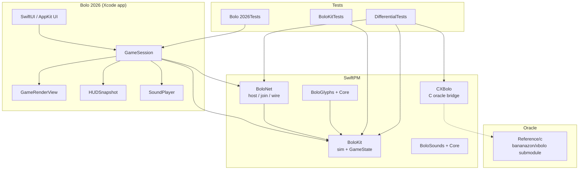
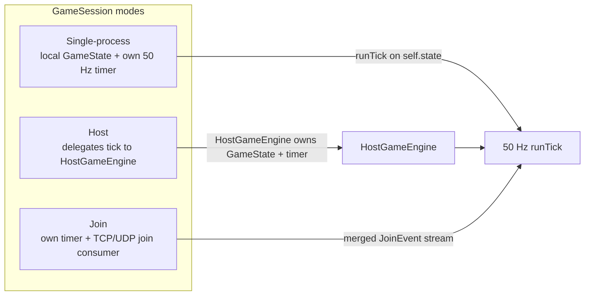
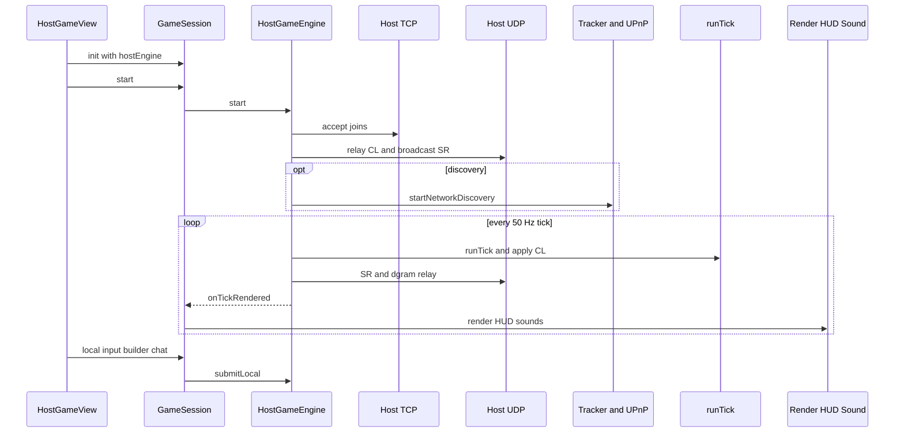
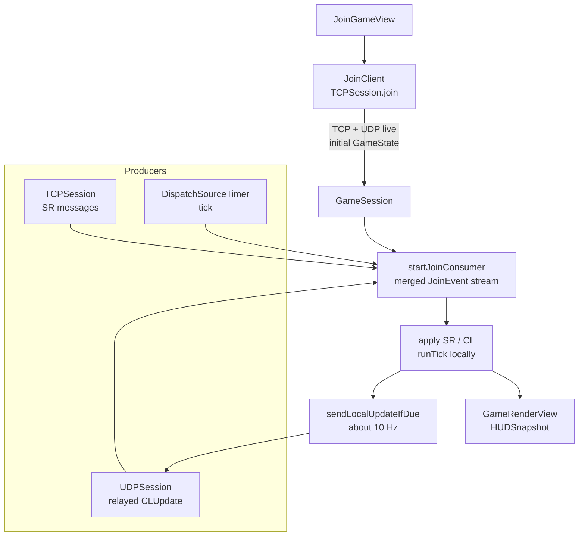
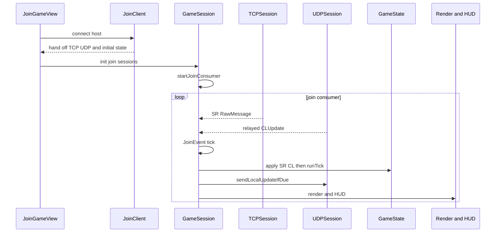
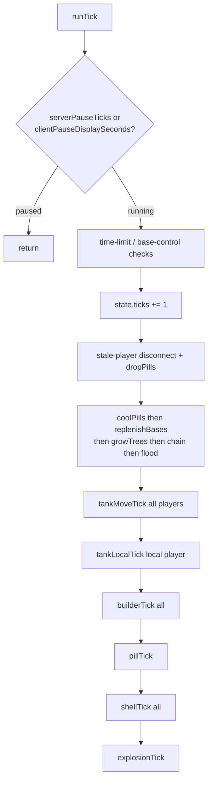
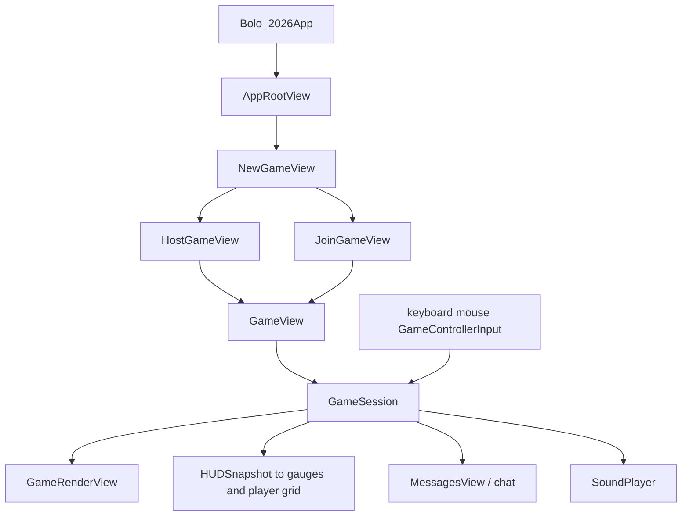
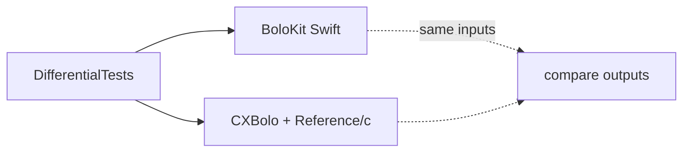
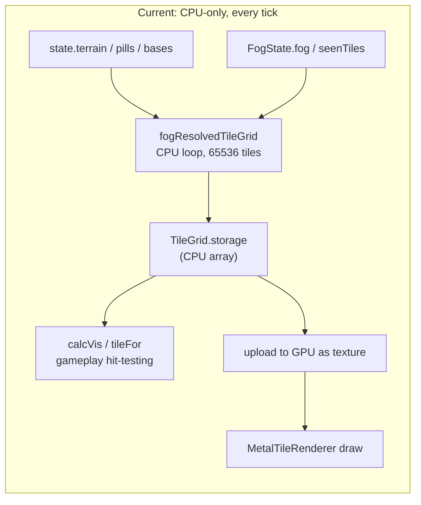
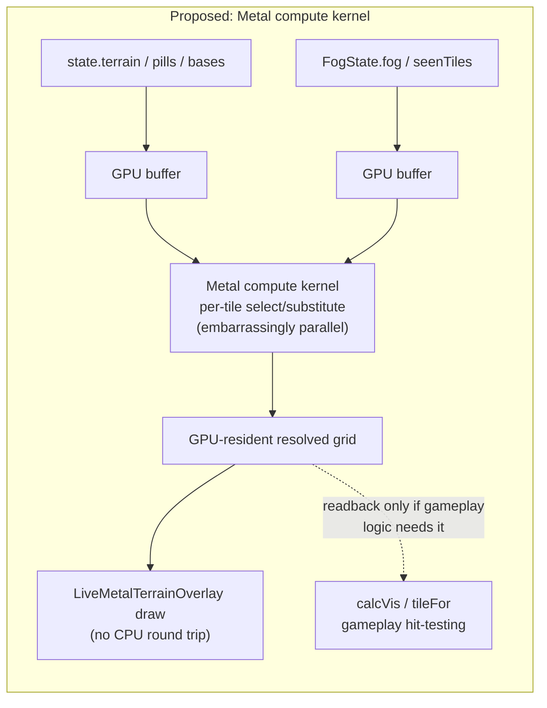

# BoloKit wiring

How **Bolo 2026** is put together: SPM packages, the three session modes, host/join network paths, and the 50 Hz tick. Grounded in `Package.swift`, `Sources/`, and `Bolo 2026/`. For fidelity rules see [CONSTRAINTS.md](CONSTRAINTS.md); for ship state see [STATUS.md](STATUS.md); for agent constraints see [`AGENTS.md`](../AGENTS.md).

## 1. Packages and targets

| Product | Role |
|---------|------|
| `BoloKit` | Authoritative `GameState`, physics, ticks, fog, map tiles. No `Foundation`. |
| `BoloNet` | Host engine, join client, TCP/UDP sessions, Bonjour, tracker, UPnP, codecs. Depends on `BoloKit`. |
| `CXBolo` | C sources compiled for bit-for-bit differential tests (`-ffp-contract=off`). |
| `BoloGlyphs` / `BoloSounds` | Build-time generators (Run Script phases); not runtime. |
| `Bolo 2026` | Playable Mac app: chrome, render, input, owns `GameSession`. |

Dependency direction is one-way: **app → BoloNet → BoloKit**. `BoloKit` never imports `BoloNet`; net cadence (`seq`, CL emission) stays in the app / `BoloNet`.

## 2. Three session modes

`GameSession` is the app-side hub. It has three constructions; only one is active per play.

| Mode | Who owns `GameState` | Who fires the timer | Local input |
|------|----------------------|---------------------|-------------|
| Single-process | `GameSession.state` | `GameSession` `DispatchSourceTimer` | Mutates `state` directly |
| Host | `HostGameEngine` (live) | Engine’s own timer; session timer **not** created | `submitLocal*` → engine event stream |
| Join | `GameSession.state` (post-handshake) | Session timer + TCP/UDP producers → one consumer | Local tank → `CLUpdate` on UDP |

Host path: session keeps a **snapshot** of state at init for bookkeeping; rendering goes through the engine’s tick callbacks (`onTickRendered`), not by re-reading that snapshot as truth.

## 3. Host path

Key types (`Sources/BoloNet/`):

- `HostGameEngine` — merged event stream, single consumer of `GameState`, fog per slot, broadcasts.
- `HostListener` / `HostAcceptLoop` / `HostSession` — TCP join / control plane.
- `HostDgramListener` / `DgramServerRelay` — UDP gameplay plane.
- `BonjourDiscovery`, `TrackerRegistration`, `PortMapping` — find-and-share (best-effort).

## 4. Join path

Key types:

- `JoinClient` / `JoinClientApply` — handshake and initial map.
- `TCPSession` / `UDPSession` / `WireIO` — framed I/O.
- `CLUpdateCodec`, `ClientMessages`, `ServerMessages`, `Preambles` — wire shapes.
- `RecvSR` / `RecvCL` (in `BoloKit`) — decode into `GameState`.
- Join lag tint uses `UDPSession.lastUpdate(for:)` vs local `seq` (v1.4.0 #3).

Guest is still a **partial client** for some gameplay (fire, range, drown/barge). Product ruling: [#59](https://github.com/CosmicCEO/BoloKit/issues/59).

## 5. Tick loop (50 Hz)

`ticksPerSec` is 50 (`Physics.swift`). Orchestrator: `runTick` in `Sources/BoloKit/RunTick.swift` (unified port of C `runserver` + `runclient` order — synthesis, not a C interleaving).

Callbacks from `runTick` (sounds, broadcasts, lag UI) are closures supplied by `GameSession` or `HostGameEngine` — that is how `BoloKit` stays free of a `BoloNet` dependency.

Fog / vision: `FogState`, `CalcVis`, host-authoritative redaction on the wire (`SRRevealTerrain`, etc.). Deliberate deviation from C’s client-side filter — see CONSTRAINTS “Fog-of-war”.

## 6. UI chrome (app layer)

Also: `bolo://` (`BoloJoinURL`), App Intents (`HostGameIntent` / `JoinLastHostIntent`), preferences / key bindings.

## 7. Oracle and tests

- Live executable spec: submodule `Reference/c` ([bananazon/xbolo](https://github.com/bananazon/xbolo), MIT).
- Cheshire original art/sound: never copy; glyphs/sounds are generated.
- WinBolo/LinBolo: GPL — read-only clean-room, no import.

## 8. Future optimization

**GPU (Metal compute) offload for fog/tile-grid resolution — idea, parked, not scheduled.**
Tracking issue: [#160](https://github.com/CosmicCEO/BoloKit/issues/160).

[#159](https://github.com/CosmicCEO/BoloKit/issues/159) (client-side fog gating for the join/solo
render paths, 2026-09-24) wired real per-tick fog resolution into paths that previously always
rendered unfogged. Measured cost, Debug build (`-Onone`, what a real desktop session actually
runs today) with Hidden Mines on:

| Path | Per-tick cost | Share of the 20 ms tick budget |
|------|---------------|----------------------------------|
| Unfogged (`displayTileGrid`, pre-#159 behavior) | ~9 ms | ~45% |
| Fogged (`fogResolvedTileGrid`, current) | ~16–17 ms | ~80–85% |

Tests pass reliably with margin at this cost, but the margin (~3–4 ms/tick) is tighter than
ideal — any future per-tick work added to the join/solo path eats directly into it.

**Why this is a plausible GPU candidate:** `fogResolvedTileGrid`/`displayTileGrid`
(`Sources/BoloKit/FogState.swift` / `Tiles.swift`) is a fixed-size (256×256), embarrassingly
parallel per-tile select/substitute transform with no cross-tile dependencies within a single
resolve pass — exactly the shape GPU compute shines at. The project already has Metal rendering
infrastructure from the v1.6.0 renderer (`MetalTileRenderer`, `LiveMetalTerrainOverlay`) a
compute-kernel output could feed directly, avoiding a CPU round trip if the result stays
GPU-resident for drawing (right diagram above).

**Why the Neural Engine (ANE/NPU) is ruled out:** present on every Apple Silicon Mac since the
M1 (2020; the underlying ANE itself debuted on the A11 Bionic, iPhone 8/X, 2017), but it's
built for CoreML-style neural-network inference (matrix multiplies) and isn't addressable
outside CoreML — a poor match for this workload's branchy, lookup-dependent substitution logic
(mine reveal state, sticky-reveal rules per `applyMineSubstitution`).

**Real tradeoffs, not a free win** (full detail in #160): CPU-side gameplay code (`calcVis` per
sprite, `tileFor` hit-testing) still needs to read individual resolved tiles, so a GPU-only
pipeline needs either a synced CPU fallback or a broader shift to make gameplay logic
GPU-buffer-aware; GPU dispatch overhead at this grid size is unmeasured and could eat into the
win; a Release (`-O`) build's real number is also unmeasured, and Debug's ~16-17ms may already
have healthier margin in what actually ships.

**Recommendation:** park until/unless the tick budget becomes a real constraint, then prototype
with a benchmark comparing GPU dispatch+readback cost against the current ~16 ms CPU number
before committing to the architecture change.

## 9. Related docs

| Doc | Topic |
|-----|--------|
| [STATUS.md](STATUS.md) | Ship version, open PRs, milestones |
| [CONSTRAINTS.md](CONSTRAINTS.md) | Physics constants, fog deviation |
| [ORACLE_COVERAGE.md](ORACLE_COVERAGE.md) | C-function coverage snapshot |
| [notes/HOSTMODELS.md](notes/HOSTMODELS.md) | In-process host vs dedicated server |
| [TEST_TWO_MAC_FOG.md](TEST_TWO_MAC_FOG.md) | Two-Mac fog checklist |
