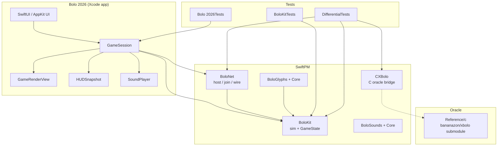
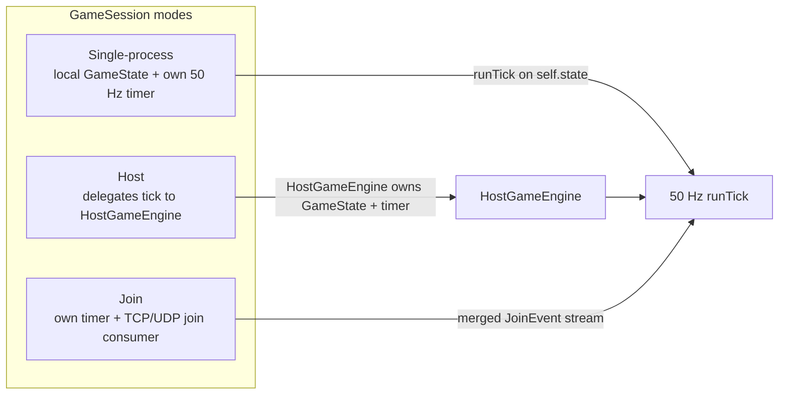
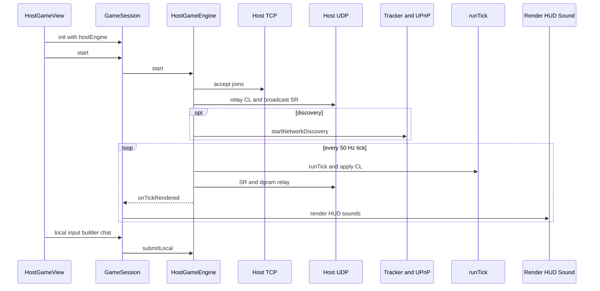
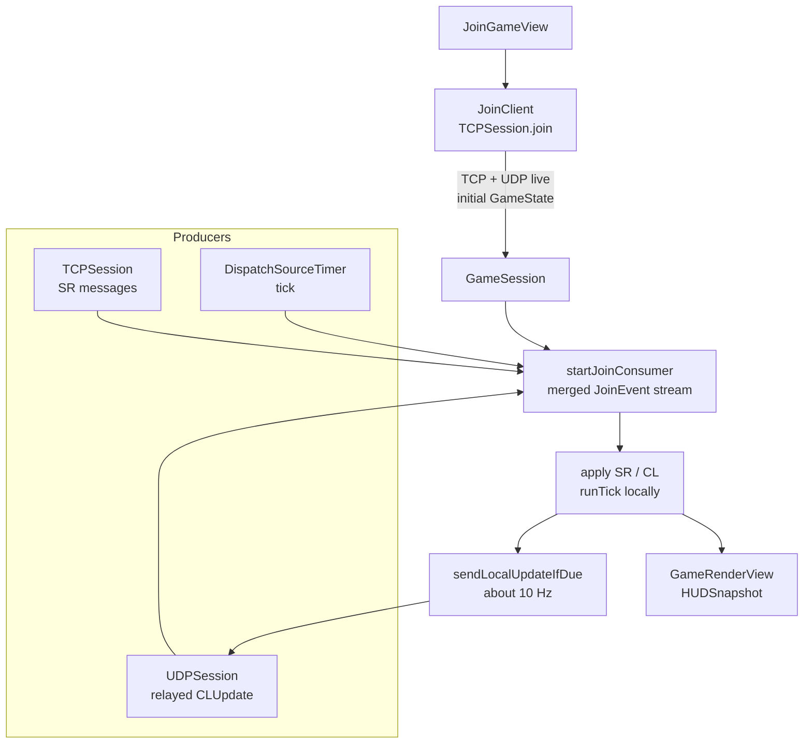
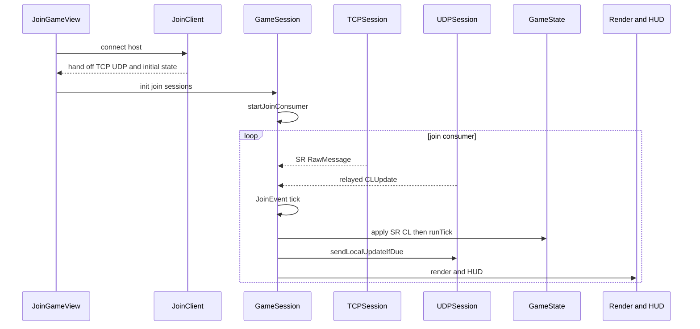
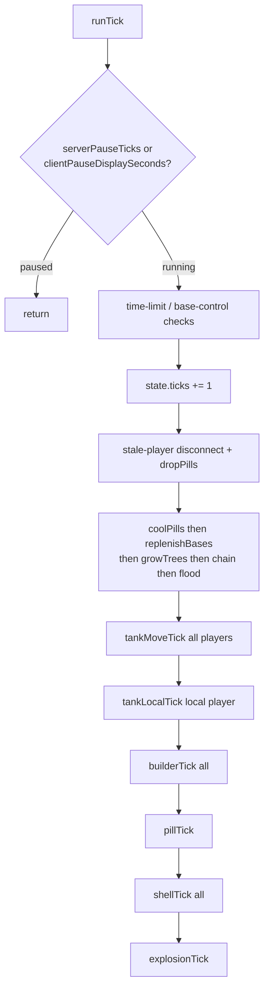
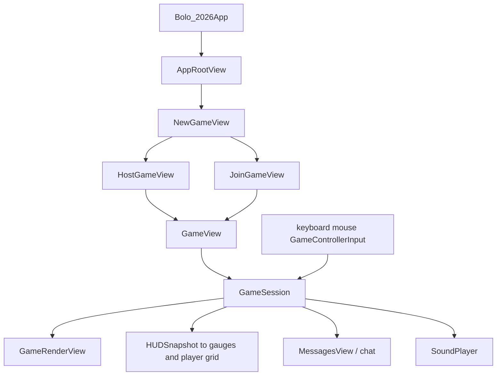
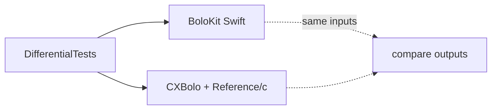
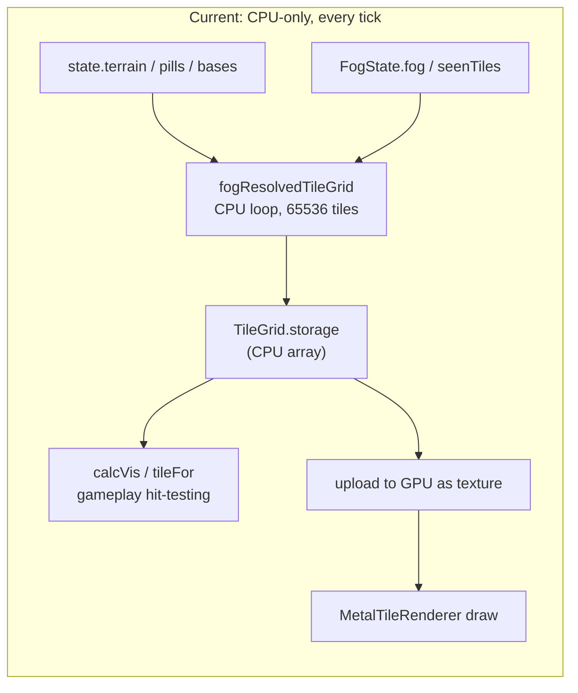
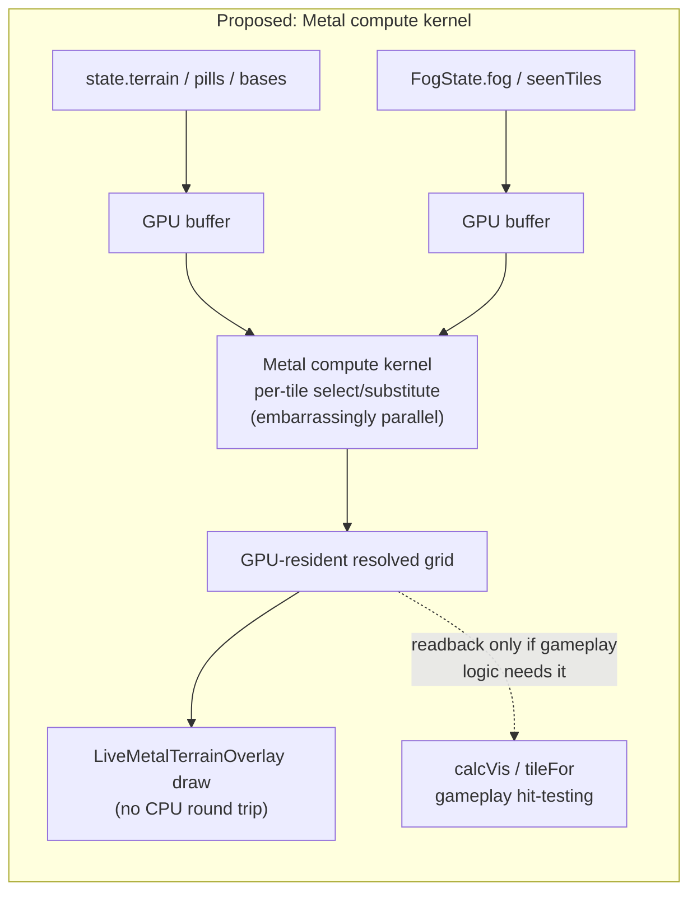

# BoloKit wiring

How **Bolo 2026** is put together: SPM packages, the three session modes, host/join network paths, and the 50 Hz tick. Grounded in `Package.swift`, `Sources/`, and `Bolo 2026/`. For fidelity rules see [CONSTRAINTS.md](CONSTRAINTS.md); for ship state see [STATUS.md](STATUS.md); for agent constraints see [`AGENTS.md`](../AGENTS.md).

## 1. Packages and targets

```mermaid
flowchart TB
  subgraph app["Bolo 2026 (Xcode app)"]
    UI["SwiftUI / AppKit UI"]
    GS["GameSession"]
    GRV["GameRenderView"]
    HUD["HUDSnapshot"]
    SP["SoundPlayer"]
  end

  subgraph spm["SwiftPM"]
    BK["BoloKit<br/>sim + GameState"]
    BN["BoloNet<br/>host / join / wire"]
    CX["CXBolo<br/>C oracle bridge"]
    BG["BoloGlyphs + Core"]
    BS["BoloSounds + Core"]
  end

  subgraph tests["Tests"]
    BKT["BoloKitTests"]
    DT["DifferentialTests"]
    APT["Bolo 2026Tests"]
  end

  subgraph oracle["Oracle"]
    REF["Reference/c<br/>bananazon/xbolo submodule"]
  end

  UI --> GS
  GS --> BK
  GS --> BN
  GS --> GRV
  GS --> HUD
  GS --> SP
  BN --> BK
  BG --> BK
  BKT --> BK
  DT --> BK
  DT --> BN
  DT --> CX
  CX -.-> REF
  APT --> GS
```

| Product | Role |
|---------|------|
| `BoloKit` | Authoritative `GameState`, physics, ticks, fog, map tiles. No `Foundation`. |
| `BoloNet` | Host engine, join client, TCP/UDP sessions, Bonjour, tracker, UPnP, codecs. Depends on `BoloKit`. |
| `CXBolo` | C sources compiled for bit-for-bit differential tests (`-ffp-contract=off`). |
| `BoloGlyphs` / `BoloSounds` | Build-time generators (Run Script phases); not runtime. |
| `Bolo 2026` | Playable Mac app: chrome, render, input, owns `GameSession`. |

Dependency direction is one-way: **app → BoloNet → BoloKit**. `BoloKit` never imports `BoloNet`; net cadence (`seq`, CL emission) stays in the app / `BoloNet`.

## 2. Three session modes

`GameSession` is the app-side hub. It has three constructions; only one is active per play.

```mermaid
flowchart LR
  subgraph modes["GameSession modes"]
    SP_MODE["Single-process<br/>local GameState + own 50 Hz timer"]
    HOST["Host<br/>delegates tick to HostGameEngine"]
    JOIN["Join<br/>own timer + TCP/UDP join consumer"]
  end

  SP_MODE -->|"runTick on self.state"| TICK["50 Hz runTick"]
  HOST -->|"HostGameEngine owns GameState + timer"| ENG["HostGameEngine"]
  ENG --> TICK
  JOIN -->|"merged JoinEvent stream"| TICK
```

| Mode | Who owns `GameState` | Who fires the timer | Local input |
|------|----------------------|---------------------|-------------|
| Single-process | `GameSession.state` | `GameSession` `DispatchSourceTimer` | Mutates `state` directly |
| Host | `HostGameEngine` (live) | Engine’s own timer; session timer **not** created | `submitLocal*` → engine event stream |
| Join | `GameSession.state` (post-handshake) | Session timer + TCP/UDP producers → one consumer | Local tank → `CLUpdate` on UDP |

Host path: session keeps a **snapshot** of state at init for bookkeeping; rendering goes through the engine’s tick callbacks (`onTickRendered`), not by re-reading that snapshot as truth.

## 3. Host path

```mermaid
sequenceDiagram
  participant UI as HostGameView
  participant GS as GameSession
  participant HGE as HostGameEngine
  participant TCP as Host TCP
  participant UDP as Host UDP
  participant TK as Tracker and UPnP
  participant Sim as runTick
  participant Out as Render HUD Sound

  UI->>GS: init with hostEngine
  UI->>GS: start
  GS->>HGE: start
  HGE->>TCP: accept joins
  HGE->>UDP: relay CL and broadcast SR
  opt discovery
    HGE->>TK: startNetworkDiscovery
  end
  loop every 50 Hz tick
    HGE->>Sim: runTick and apply CL
    HGE->>UDP: SR and dgram relay
    HGE-->>GS: onTickRendered
    GS->>Out: render HUD sounds
  end
  UI->>GS: local input builder chat
  GS->>HGE: submitLocal
```

Key types (`Sources/BoloNet/`):

- `HostGameEngine` — merged event stream, single consumer of `GameState`, fog per slot, broadcasts.
- `HostListener` / `HostAcceptLoop` / `HostSession` — TCP join / control plane.
- `HostDgramListener` / `DgramServerRelay` — UDP gameplay plane.
- `BonjourDiscovery`, `TrackerRegistration`, `PortMapping` — find-and-share (best-effort).

## 4. Join path

```mermaid
flowchart TB
  JV["JoinGameView"] --> JC["JoinClient<br/>TCPSession.join"]
  JC -->|"TCP + UDP live<br/>initial GameState"| GS["GameSession"]
  GS --> CONS["startJoinConsumer<br/>merged JoinEvent stream"]

  subgraph producers["Producers"]
    TCP["TCPSession<br/>SR messages"]
    UDP["UDPSession<br/>relayed CLUpdate"]
    TMR["DispatchSourceTimer<br/>tick"]
  end

  TCP --> CONS
  UDP --> CONS
  TMR --> CONS

  CONS --> APPLY["apply SR / CL<br/>runTick locally"]
  APPLY --> SEND["sendLocalUpdateIfDue<br/>about 10 Hz"]
  SEND --> UDP
  APPLY --> OUT["GameRenderView<br/>HUDSnapshot"]
```

```mermaid
sequenceDiagram
  participant UI as JoinGameView
  participant JC as JoinClient
  participant GS as GameSession
  participant TCP as TCPSession
  participant UDP as UDPSession
  participant Sim as GameState
  participant Out as Render and HUD

  UI->>JC: connect host
  JC-->>UI: hand off TCP UDP and initial state
  UI->>GS: init join sessions
  GS->>GS: startJoinConsumer
  loop join consumer
    TCP-->>GS: SR RawMessage
    UDP-->>GS: relayed CLUpdate
    GS->>GS: JoinEvent tick
    GS->>Sim: apply SR CL then runTick
    GS->>UDP: sendLocalUpdateIfDue
    GS->>Out: render and HUD
  end
```

Key types:

- `JoinClient` / `JoinClientApply` — handshake and initial map.
- `TCPSession` / `UDPSession` / `WireIO` — framed I/O.
- `CLUpdateCodec`, `ClientMessages`, `ServerMessages`, `Preambles` — wire shapes.
- `RecvSR` / `RecvCL` (in `BoloKit`) — decode into `GameState`.
- Join lag tint uses `UDPSession.lastUpdate(for:)` vs local `seq` (v1.4.0 #3).

The host simulates guest tanks (combat, tile entry, death/respawn); the guest keeps movement and builder authority and thins its own tick once the first `SRTankStatus` arrives (`JoinTickThinning`). Ruling [#59](https://github.com/CosmicCEO/BoloKit/issues/59), staged in [#62](https://github.com/CosmicCEO/BoloKit/issues/62). See §9.

## 5. Tick loop (50 Hz)

`ticksPerSec` is 50 (`Physics.swift`). Orchestrator: `runTick` in `Sources/BoloKit/RunTick.swift` (unified port of C `runserver` + `runclient` order — synthesis, not a C interleaving).

```mermaid
flowchart TB
  START["runTick"] --> PAUSE{"serverPauseTicks or<br/>clientPauseDisplaySeconds?"}
  PAUSE -->|paused| RET1["return"]
  PAUSE -->|running| TL["time-limit / base-control checks"]
  TL --> INC["state.ticks += 1"]
  INC --> LAG["stale-player disconnect + dropPills"]
  LAG --> WORLD["coolPills then replenishBases<br/>then growTrees then chain then flood"]
  WORLD --> MOVE["tankMoveTick all players"]
  MOVE --> LOCAL["tankLocalTick local player"]
  LOCAL --> BLD["builderTick all"]
  BLD --> PILL["pillTick"]
  PILL --> SHELL["shellTick all"]
  SHELL --> EXP["explosionTick"]
```

Callbacks from `runTick` (sounds, broadcasts, lag UI) are closures supplied by `GameSession` or `HostGameEngine` — that is how `BoloKit` stays free of a `BoloNet` dependency.

Fog / vision: `FogState`, `CalcVis`, host-authoritative redaction on the wire (`SRRevealTerrain`, etc.). Deliberate deviation from C’s client-side filter — see CONSTRAINTS “Fog-of-war”.

## 6. UI chrome (app layer)

```mermaid
flowchart TB
  APP["Bolo_2026App"] --> ROOT["AppRootView"]
  ROOT --> NEW["NewGameView"]
  NEW --> HOSTV["HostGameView"]
  NEW --> JOINV["JoinGameView"]
  HOSTV --> GV["GameView"]
  JOINV --> GV
  GV --> GS["GameSession"]
  GS --> GRV["GameRenderView"]
  GS --> HUD["HUDSnapshot to gauges and player grid"]
  GS --> MSG["MessagesView / chat"]
  GS --> SP["SoundPlayer"]
  INPUT["keyboard mouse GameControllerInput"] --> GS
```

Also: `bolo://` (`BoloJoinURL`), App Intents (`HostGameIntent` / `JoinLastHostIntent`), preferences / key bindings.

## 7. Oracle and tests

```mermaid
flowchart LR
  XC["DifferentialTests"] --> SWIFT["BoloKit Swift"]
  XC --> C["CXBolo + Reference/c"]
  SWIFT -.->|"same inputs"| CMP["compare outputs"]
  C -.-> CMP
```

- Live executable spec: submodule `Reference/c` ([bananazon/xbolo](https://github.com/bananazon/xbolo), MIT).
- Cheshire original art/sound: never copy; glyphs/sounds are generated.
- WinBolo/LinBolo: GPL — read-only clean-room, no import.

## 8. Future optimization

**GPU (Metal compute) offload for fog/tile-grid resolution — idea, parked, not scheduled.**
Tracking issue: [#160](https://github.com/CosmicCEO/BoloKit/issues/160).

[#159](https://github.com/CosmicCEO/BoloKit/issues/159) (client-side fog gating for the join/solo
render paths, 2026-09-24) wired real per-tick fog resolution into paths that previously always
rendered unfogged. Measured cost, Debug build (`-Onone`, what a real desktop session actually
runs today) with Hidden Mines on:

| Path | Per-tick cost | Share of the 20 ms tick budget |
|------|---------------|----------------------------------|
| Unfogged (`displayTileGrid`, pre-#159 behavior) | ~9 ms | ~45% |
| Fogged (`fogResolvedTileGrid`, current) | ~16–17 ms | ~80–85% |

Tests pass reliably with margin at this cost, but the margin (~3–4 ms/tick) is tighter than
ideal — any future per-tick work added to the join/solo path eats directly into it.

```mermaid
flowchart LR
  subgraph current["Current: CPU-only, every tick"]
    LIVE1["state.terrain / pills / bases"] --> RESOLVE["fogResolvedTileGrid<br/>CPU loop, 65536 tiles"]
    FOG1["FogState.fog / seenTiles"] --> RESOLVE
    RESOLVE --> GRID1["TileGrid.storage<br/>(CPU array)"]
    GRID1 --> CALCVIS["calcVis / tileFor<br/>gameplay hit-testing"]
    GRID1 --> UPLOAD["upload to GPU as texture"]
    UPLOAD --> DRAW1["MetalTileRenderer draw"]
  end
```

```mermaid
flowchart LR
  subgraph proposed["Proposed: Metal compute kernel"]
    LIVE2["state.terrain / pills / bases"] --> BUF1["GPU buffer"]
    FOG2["FogState.fog / seenTiles"] --> BUF2["GPU buffer"]
    BUF1 --> KERNEL["Metal compute kernel<br/>per-tile select/substitute<br/>(embarrassingly parallel)"]
    BUF2 --> KERNEL
    KERNEL --> GPUOUT["GPU-resident resolved grid"]
    GPUOUT --> DRAW2["LiveMetalTerrainOverlay draw<br/>(no CPU round trip)"]
    GPUOUT -.->|"readback only if gameplay<br/>logic needs it"| CALCVIS2["calcVis / tileFor<br/>gameplay hit-testing"]
  end
```

**Why this is a plausible GPU candidate:** `fogResolvedTileGrid`/`displayTileGrid`
(`Sources/BoloKit/FogState.swift` / `Tiles.swift`) is a fixed-size (256×256), embarrassingly
parallel per-tile select/substitute transform with no cross-tile dependencies within a single
resolve pass — exactly the shape GPU compute shines at. The project already has Metal rendering
infrastructure from the v1.6.0 renderer (`MetalTileRenderer`, `LiveMetalTerrainOverlay`) a
compute-kernel output could feed directly, avoiding a CPU round trip if the result stays
GPU-resident for drawing (right diagram above).

**Why the Neural Engine (ANE/NPU) is ruled out:** present on every Apple Silicon Mac since the
M1 (2020; the underlying ANE itself debuted on the A11 Bionic, iPhone 8/X, 2017), but it's
built for CoreML-style neural-network inference (matrix multiplies) and isn't addressable
outside CoreML — a poor match for this workload's branchy, lookup-dependent substitution logic
(mine reveal state, sticky-reveal rules per `applyMineSubstitution`).

**Real tradeoffs, not a free win** (full detail in #160): CPU-side gameplay code (`calcVis` per
sprite, `tileFor` hit-testing) still needs to read individual resolved tiles, so a GPU-only
pipeline needs either a synced CPU fallback or a broader shift to make gameplay logic
GPU-buffer-aware; GPU dispatch overhead at this grid size is unmeasured and could eat into the
win; a Release (`-O`) build's real number is also unmeasured, and Debug's ~16-17ms may already
have healthier margin in what actually ships.

**Recommendation:** park until/unless the tick budget becomes a real constraint, then prototype
with a benchmark comparing GPU dispatch+readback cost against the current ~16 ms CPU number
before committing to the architecture change.

## 9. Divergence from Oracle

Networking is the one area built on purpose to differ from the oracle. The oracle is XBolo (`Reference/c`, submodule [bananazon/xbolo](https://github.com/bananazon/xbolo) at `51c3cbc`), itself the executable spec for Mac Bolo **0.99.7bv** behaviour. Governing decisions:

- **D4** — "Self-contained, you and friends… no WinBolo interop" (CONSTRAINTS "License and oracle"). No interop requirement of any kind.
- **D31** — port the wire format byte-exact from the C (so it can be differentially tested), rebuild the transport on Network.framework + async/await (`docs/PLAN.md` at tag `legacy-agent-process`).
- **#59 / #62** — owner ruling 2026-09-21: the host simulates guest tanks (`GameState.hostSimulatesRemotePlayers`); staged S1–S6, closed 2026-09-22. See CONSTRAINTS "Host is also a client", "Host-simulated guest tanks (#59/#62)", "Fog-of-war".

Last verified against `ae56e81`, 2026-09-30 (read from code; no live XBolo ↔ Bolo 2026 session has been run). C references are to `Reference/c/`.

**Legend:** **Same** — same bytes and behaviour. **Compatible** — different mechanism, still interoperates. **Incompatible** — breaks interop or changes game behaviour. *Inferred* — read from code, not tested.

### 9.1 Per-area summary

| Area | Status | Bolo 2026 | XBolo |
|------|--------|-----------|-------|
| Transport | Compatible | Network.framework `NWListener`/`NWConnection`, TCP + UDP on one port (default 50000), IPv4 forced, `TCP_NODELAY`. Guest UDP uses an ephemeral local port. `HostListener.swift`, `HostDgramListener.swift`, `TCPSession.swift`, `UDPSession.swift` | BSD sockets, pthread + `select()`, IPv4, `TCP_NODELAY`. Client binds UDP to its TCP local port (`client.c:587-604`); server takes the port from each accepted datagram (`server.c:614-697`) |
| Authority | Incompatible | One authoritative `GameState` in `HostGameEngine`. Host runs combat, tile entry, pills, mines, drowning, damage and respawn for each guest from its input flags (`RunTick.swift:302`). Guest owns movement and builder fields only | Relay server with world bookkeeping (`runserver`, `server.c:1083-1257`). Each client fully simulates its own tank (`runclient`, `client.c:425-497`) and reports results over TCP |
| Message formats | Incompatible (codecs Same) | Opcodes 0–19 / 0–33, 113-byte `CLUpdate`, preambles byte-identical (`WireIO`, `CLUpdateCodec`, `ClientMessages`, `ServerMessages`, `Preambles`; `NetCodecDifferentialTests`). **Adds SR opcodes 34 `SRRevealTerrain`, 35 `SRTankStatus`, 36 `SRTankShots`** | `bolo.h`. No length prefix: an unknown SR opcode on the client exits the app (`client.c:937-939`, `1244-1249`) |
| Timing and lag | Compatible | 50 Hz `DispatchSourceTimer` on the main queue; `CLUpdate` every 5 ticks; lag tint 1 s / 3 s; 9 s eviction; dead reckoning capped at 3 s (`DgramClientApply.swift:41`); host skips dead reckoning for guests it simulates (`:125`) | 50 Hz thread loop with catch-up (`client.c:1004-1122`); same cadence and thresholds; unbounded dead reckoning (`client.c:1446-1454`) |
| Reliability | Compatible | TCP for events, UDP newest-wins by seq (`isNewerSeq`). Host-simulated guest's own shells go over **TCP every tick** while in flight (`SRTankShots`) | Same split; shells travel inside the owner's UDP `CLUpdate` |
| Join / handshake / version | Same bytes, gaps | `JoinPreamble` "XBOLOGAM" v1, same check order (`SessionLogic.evaluateJoinRequest`); plaintext password. **Version still 1** despite 34–36. Ban key is `"\(connection.endpoint)"` (`HostListener.swift:135`) | `server.c:734` version check, `strcmp` password; ban on name + `sin_addr` (`server.c:509-523`) |
| State replication | Incompatible | See 9.2 | See 9.2 |
| Fog | Incompatible (by design) | Host tracks `FogState` per slot and redacts the initial map and terrain sends (`redactedTerrainGrid`, `terrainVisibilityMask`); hidden mines never announced; Hidden Mines on by default | Client-side filter only; every client holds the full map and all mines |
| Alliances and chat | Same | `CLSetAlliance` → `SRSetAlliance`; `CLSendMesg` mask, nearby < 8.5 (`ChatMessage.computeMessageMask`) | `client.c:6705-6746`, `server.c` relay |
| Tracker / discovery | Tracker Same; rest added | `TrackerRegistration`, `TrackerBrowser`, `Tracker.swift`: "XBOLOTRK" v0, 60/64-byte records, 60 s heartbeat including the missing-`htonl` bug (`TrackerDifferentialTests`). Adds Bonjour `_bolo2026._tcp`, `bolo://join?host=&port=` (`BoloJoinURL`), App Intents. No tracker daemon | `tracker.c`/`tracker.h` (port 40000), `server.h:20`; default `tracker.xbolo.org` (`DefaultPreferences.plist`); no URL scheme |
| NAT / security | Compatible | `PortMapping.swift` wraps `DNSServiceNATPortMappingCreate` (TCP + UDP, system-chosen external port). No encryption or auth. Combat and fog are host-enforced | TCMPortMapper, GPL (`GSXBoloController.m:512-1152`). No encryption or auth; server trusts all client reports |

### 9.2 State replication by entity

| Entity | Bolo 2026 | XBolo | Status |
|--------|-----------|-------|--------|
| Terrain | Client-driven changes use the C messages. Changes from the host's own sim go out as `SRRevealTerrain` for **every** changed tile, Hidden Mines or not (`HostGameEngine.swift:829-844`) | SR messages triggered by client reports | Incompatible |
| Pills / bases | Host diffs ownership after `runTick` and sends `SRCapturePill`/`SRCaptureBase` | Same messages, triggered by `CLGrabTile` | Compatible |
| Tanks | Relayed `CLUpdate` is re-assembled from host state (`HostDgramListener.swift:249-253`), seq array from the host's receive table. `SRTankStatus` unicast to the owner on change (`tankStatusSends`, `HostGameEngine.swift:1003`) | Raw bytes relayed; server stores x/y only | Incompatible |
| Shells / explosions | Host-simulated; others see them in the re-assembled `CLUpdate`, the owner via `SRTankShots` (`tankShotsSends`, `:1033`) | Inside the shooter's own `CLUpdate` | Incompatible |
| Mines | Not announced under Hidden Mines (`HostSession.swift` `.dropMine`/`.placeMine`); host debits a simulated guest's mines ([#174](https://github.com/CosmicCEO/BoloKit/issues/174)) | `SRDropMine`/`SRPlaceMine` to everyone; client owns its mine count | Incompatible |
| Builders | `CLBuild*` → `SRBuilderAck`; guest keeps builder authority | Same round trip | Same |

### 9.3 Interop verdict

Codecs are byte-compatible; live play is not.

- **XBolo client on a Bolo 2026 host — fails.** Handshake and map succeed, then the host's first tick sends `SRTankStatus` (opcode 35; `tankStatusSends` has no prior status for the slot) and XBolo's `recvclient` hits its default case and `exit(EXIT_FAILURE)`. Opcodes 34 and 36 would do the same. Even without them, the client self-simulates while the host simulates it too. *Inferred.*
- **Bolo 2026 guest on an XBolo host — degraded.** No `SRTankStatus` ever arrives, so `hostSimulatesMe` stays false (`GameSession.swift:907`) and the guest falls back to the pre-#62 partial client: it moves and builds, but never runs `tankLocalTick` and never sends `CLHitTank`, `CLRefuel`, `CLTouch` or `CLSmallBoom`/`CLSuperBoom`, so firing, refuelling and drowning likely don't work. *Inferred.*
- **Tracker — interoperable both ways.** Both advertise "XBOLOGAM" v1, so a listing can't tell them apart.

### 9.4 Gameplay feel

- **Own actions cost a round trip.** A guest's shot waits for the next `CLUpdate` (≤ 100 ms), travels to the host, and returns as `SRTankShots`; damage and death return as `SRTankStatus`. XBolo applies them locally at once. Movement stays local in both.
- **Hits are judged on stale positions.** The host doesn't extrapolate guests it simulates, so it tests hits against positions about half an RTT plus up to 100 ms old. In return, hits are host-adjudicated and harder to forge.
- **Loss stalls combat.** Shells and status ride TCP, so a lost segment delays them; the v1.6.9 benchmark lists moving `SRTankShots` off the reliable channel as a hypothesis (`Bench/3-analyze/README.md`).
- **Remote smoothing does not engage in practice.** `RemotePositionSmoother` is meant to draw remote tanks 5 ticks late, but the benchmark measured the host's tank moving on the guest's screen only every 141–400 ms (`Bench/3-analyze/README.md`).

### 9.5 Adds and drops

- **Adds:** opcodes 34–36, host simulation of guests, per-slot fog redaction, Bonjour, `bolo://`, App Intents, dead-reckoning cap, IPv4 forcing, solo fallback when the listener can't bind, game-name field, local-only game-event chat lines.
- **Drops:** dedicated host binary ([HOSTMODELS.md](HOSTMODELS.md), #6), tracker daemon (#9), GUI host as a client of its own server, verbatim datagram relay, TCMPortMapper, any WinBolo interop.

### 9.6 Open questions / suspected issues

- **Interop intent is undecided.** #59 asked "Do we want real XBolo clients to keep joining a Bolo 2026 host?"; the ruling didn't answer. If not, bump `NET_GAME_VERSION` (or the ident) so XBolo refuses cleanly instead of quitting. Draft PR #186 records the wire format as closed to 1.* and open to 2.* releases.
- **Legacy tracker listing (#181).** A Bolo 2026 host listed on `tracker.xbolo.org` looks joinable to XBolo players, who would then crash.
- **Ban includes the source port.** `"\(connection.endpoint)"` is probably `ip:port`, and the ban requires name *and* address to match, so a banned player likely gets back in on reconnect. C matches name + IP. *Inferred.*
- **Tracker announce is nil on fresh installs.** `HostGameView.swift:363` reads `UserDefaults` `GSTrackerString` directly; `tracker.xbolo.org` exists only as the `@AppStorage` default in `PreferencesView.swift:58`, so announce is skipped until Preferences is edited. *Inferred.*
- **Tracker gets the internal port.** `startNetworkDiscovery` advertises `advertisedPort`, and `PortMapping`'s external port is only logged. *Inferred.*
- **Host still accepts self-reports from simulated guests.** `HostSession.swift` `.touch`, `.grabTile`, `.damage`, `.smallBoom`, `.superBoom`, `.refuel`, `.hitTank` have no `hostSimulatesRemotePlayers` gate. A thinned Bolo 2026 guest doesn't send most of them; an XBolo or modified client would be double-applied or could forge them. *Inferred.*
- **No interop test.** C socket code isn't compiled into `CXBolo`; `JoinClientTests` uses a Swift-scripted host.

## 10. Related docs

| Doc | Topic |
|-----|--------|
| [STATUS.md](STATUS.md) | Ship version, open PRs, milestones |
| [CONSTRAINTS.md](CONSTRAINTS.md) | Physics constants, fog deviation |
| [ORACLE_COVERAGE.md](ORACLE_COVERAGE.md) | C-function coverage snapshot |
| [HOSTMODELS.md](HOSTMODELS.md) | In-process host vs dedicated server |
